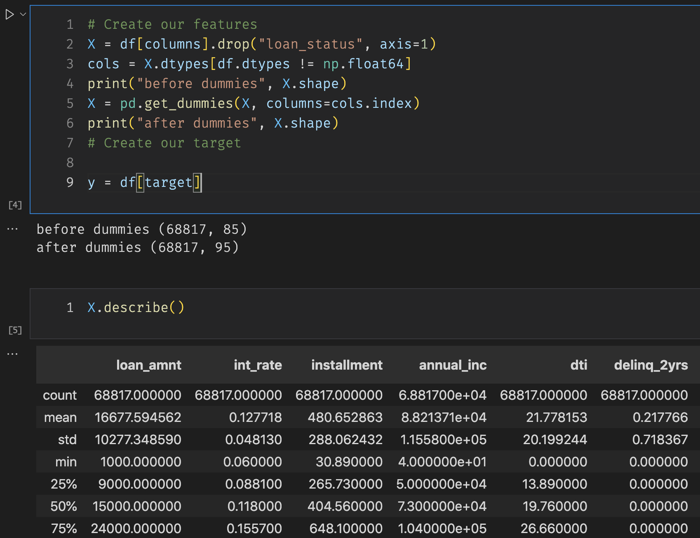
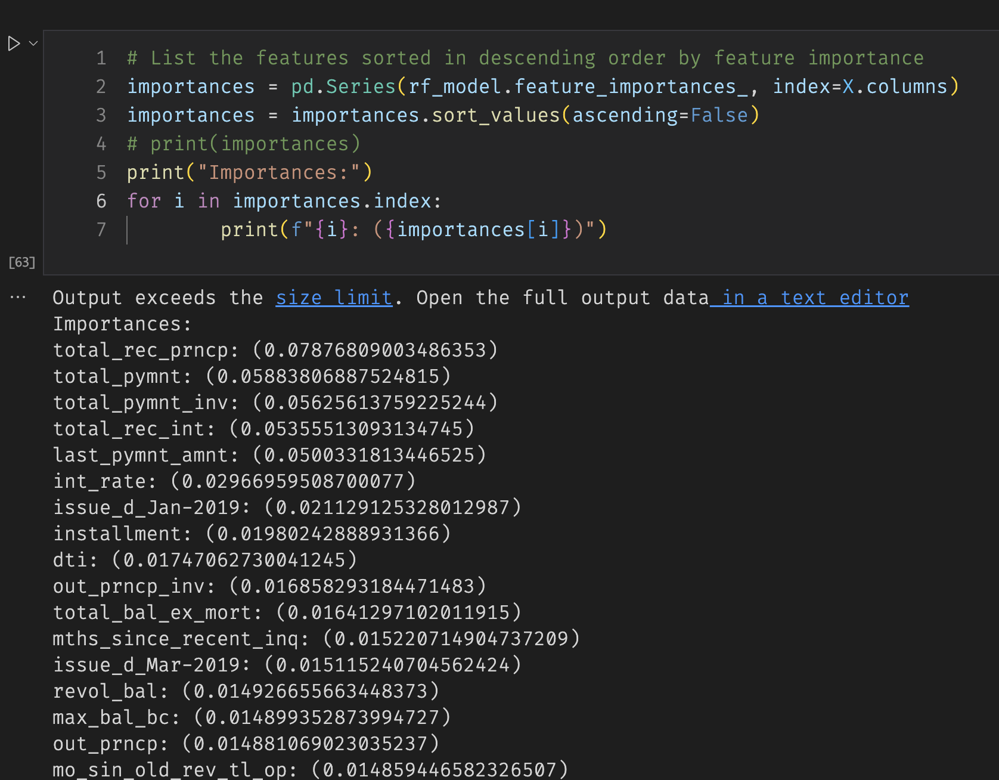

- [Credit Risk Analysis](#orgbdc8bed)
  - [Overview](#orged769d0)
  - [Results](#org202e02e)
    - [Naive Random Oversampling](#org6e95d9e)
    - [SMOTE Oversampling](#orgafcc19a)
    - [Cluster Centroids Undersampling](#org2216991)
    - [Combination (Over-Under sampling) SMOTEEN](#org942b234)
    - [Balanced Random Forest](#org800bc27)
    - [AdaBoost](#org76d3848)
  - [Summary](#orgcb8d82e)

# Credit Risk Analysis

## Overview

In this project we had the task to find a Machine Learning model that will help us decide on wheter or not lending loands based on credit card data from LendingClub. We decided to use various sampling techniques to overcome the unbalanced distribution of good to risky loans, as our model needs to be able to predict the later ones. We managed to collect enough information from evaluating different models so we can make decisions based on the results.

## Results

Before training the models we had to clean the data, mostly separating them and converting them to numeric values so the model can process it.

The results were the following:

### Naive Random Oversampling

Accuracy:

    0.6488335193435153

Matrix:

    [[   73    28]
     [ 6904 10200]]

Report:

|             | pre  | rec  | spe  | f1   | geo  | iba  | sup   |  |
|----------- |---- |---- |---- |---- |---- |---- |----- |--- |
| high\_risk  | 0.01 | 0.72 | 0.60 | 0.02 | 0.66 | 0.44 | 101   |  |
| low\_risk   | 1.00 | 0.60 | 0.72 | 0.75 | 0.66 | 0.43 | 17104 |  |
|             |      |      |      |      |      |      |       |  |
| avg n total | 0.99 | 0.60 | 0.72 | 0.74 | 0.66 | 0.43 | 17205 |  |

### SMOTE Oversampling

Accuracy:

    0.662861851549982

Matrix:

    [[   64    37]
     [ 5267 11837]]

Report:

|             | pre  | rec  | spe  | f1   | geo  | iba  | sup   |  |
|----------- |---- |---- |---- |---- |---- |---- |----- |--- |
| high\_risk  | 0.01 | 0.63 | 0.69 | 0.02 | 0.66 | 0.44 | 101   |  |
| low\_risk   | 1.00 | 0.69 | 0.63 | 0.82 | 0.66 | 0.44 | 17104 |  |
|             |      |      |      |      |      |      |       |  |
| avg n total | 0.99 | 0.69 | 0.63 | 0.81 | 0.66 | 0.44 | 17205 |  |

### Cluster Centroids Undersampling

Accuracy:

    0.5447339051023905

Matrix:

    [[   70    31]
     [10324  6780]]

Report:

|             | pre  | rec  | spe  | f1   | geo  | iba  | sup   |  |
|----------- |---- |---- |---- |---- |---- |---- |----- |--- |
| high\_risk  | 0.01 | 0.69 | 0.40 | 0.01 | 0.52 | 0.28 | 101   |  |
| low\_risk   | 1.00 | 0.40 | 0.69 | 0.57 | 0.52 | 0.27 | 17104 |  |
|             |      |      |      |      |      |      |       |  |
| avg n total | 0.99 | 0.40 | 0.69 | 0.56 | 0.52 | 0.27 | 17205 |  |

### Combination (Over-Under sampling) SMOTEEN

Accuracy:

    0.6488335193435153

Matrix:

    [[  73   28]
     [7271 9833]]

Report:

|             | pre  | rec  | spe  | f1   | geo  | iba  | sup   |  |
|----------- |---- |---- |---- |---- |---- |---- |----- |--- |
| high\_risk  | 0.01 | 0.72 | 0.57 | 0.02 | 0.64 | 0.42 | 101   |  |
| low\_risk   | 1.00 | 0.57 | 0.72 | 0.73 | 0.64 | 0.41 | 17104 |  |
|             |      |      |      |      |      |      |       |  |
| avg n total | 0.99 | 0.58 | 0.72 | 0.73 | 0.64 | 0.41 | 17205 |  |

### Balanced Random Forest

Accuracy:

    0.7885466545953005

Matrix:

    [[   71    30]
     [ 2153 14951]]

Report:

|             | pre  | rec  | spe  | f1   | geo  | iba  | sup   |  |
|----------- |---- |---- |---- |---- |---- |---- |----- |--- |
| high\_risk  | 0.03 | 0.70 | 0.87 | 0.06 | 0.78 | 0.60 | 101   |  |
| low\_risk   | 1.00 | 0.87 | 0.70 | 0.93 | 0.78 | 0.62 | 17104 |  |
|             |      |      |      |      |      |      |       |  |
| avg n total | 0.99 | 0.87 | 0.70 | 0.93 | 0.78 | 0.62 | 17205 |  |

### AdaBoost

Accuracy:

    0.9316600714093861

Matrix:

    [[   93     8]
     [  983 16121]]

Report:

|             | pre  | rec  | spe  | f1   | geo  | iba  | sup   |  |
|----------- |---- |---- |---- |---- |---- |---- |----- |--- |
|             |      |      |      |      |      |      |       |  |
| high\_risk  | 0.09 | 0.92 | 0.94 | 0.16 | 0.93 | 0.87 | 101   |  |
| low\_risk   | 1.00 | 0.94 | 0.92 | 0.97 | 0.93 | 0.87 | 17104 |  |
|             |      |      |      |      |      |      |       |  |
| avg n total | 0.99 | 0.94 | 0.92 | 0.97 | 0.93 | 0.87 | 17205 |  |

When using the Balanced Random Forest, we were able to get a list of features sorted by importance.

## Summary

The most successful models were the ones that used Ensemble techniques like the Balanced Random Forest and Ada Boost just because we get a much better Harmonic Mean / f1 score as well as highes precision on the under-represented &ldquo;high risk&rdquo; class. However we cannot recommend to use any of these models just now because the precision in the &ldquo;high risk&rdquo; class remains too low, even with the high scores in Recall and Accuracy. We could argue that these models can help us detect low risk loans very efficiently but we want to be able to predict the high risk ones.
