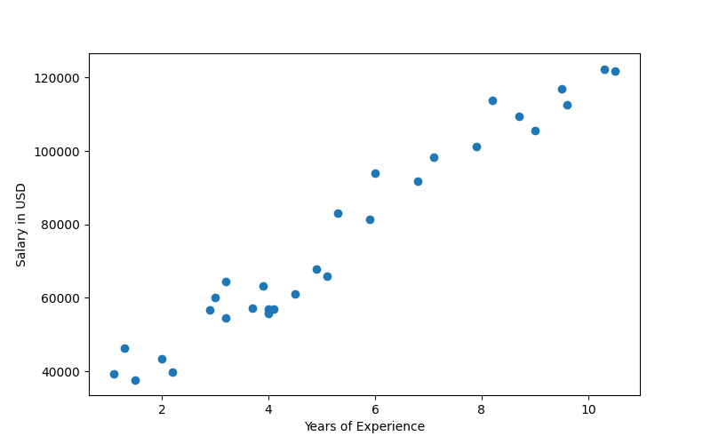
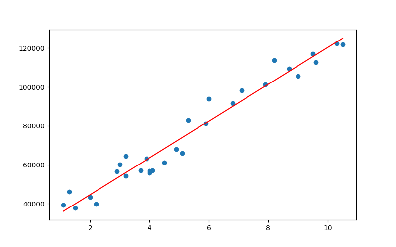
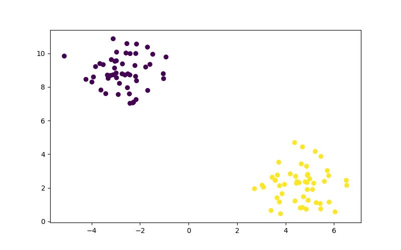
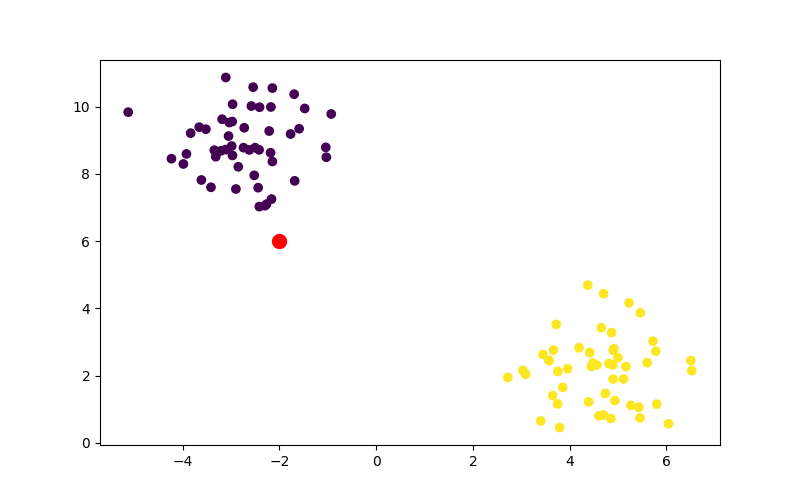
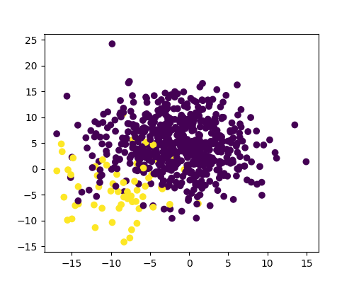

# Machine Learning

ML is the use of statistical algorithm to perform tasks such as learning from data patterns and making predictions. There are different models (mathematical representations of real-world phenomena). It can be divided into: supervised, unsupervised and deep learning.


## Supervised Learning

Deals with labeled data, for example, determining wether a patient has diabetes or not.

| Age | BMI | Has Diabetes |
|--- |--- |------------ |
| 31  | 24  | No           |
| 68  | 39  | Yes          |
| 57  | 35  | ?            |

Based on data across different categories and measurements, we try to get an answer on the next patient. In this case, based on age and BMI.


## Unsupervised Learning

Work with datasets without labeled outcomes, so answers or labels as correct answers are not provided. One example can be grouping objects by shape in different clusters.


# Supervised Learning

It can be broadly divided into regression and classification.


## Regression

Is used to predict continuous variables. For example, predict a person weight based on other factors like height, diet, exercise.


## Classification

Is used to predict discrete outcomes. For example, predict if a person will vote on a particular issue depending on their age, sex, income, geographical location, etc. The outcome is either &ldquo;Yes&rdquo; or &ldquo;No&rdquo;, the classification model would attempt to learn patterns from the data and gain accurate prediction from it.


## Regression vs. Classification

The difference between them is that regression tries to predict a continuous variable while classification tries to predict ordinal data.

In both, a dataset is divided into features and target. **Features** are variables used to make a prediction while **Target** is the predicted outcome.


# Linear Regression in Python


## Load the Data

```python
import pandas as pd
from pathlib import Path
import matplotlib.pyplot as plt
from sklearn.linear_model import LinearRegression

resources = Path("../resources")
df = pd.read_csv(resources / "Salary_Data.csv")
print(df.head())
```

       YearsExperience   Salary
    0              1.1  39343.0
    1              1.3  46205.0
    2              1.5  37731.0
    3              2.0  43525.0
    4              2.2  39891.0


## Plot the Data

Now we can plot the data to get an idea of the distribution.

```python
output = resources / "salary1.png"
fig, ax = plt.subplots(figsize=(8, 5))
ax.scatter(df.YearsExperience, df.Salary)
ax.set_xlabel('Years of Experience')
ax.set_ylabel('Salary in USD')
fig.savefig(output)
print("#+attr_html: :width 500px")
print(f"[[{output}]]")
```

<div class="org" id="org1c38aaf">

<div id="org5bc575d" class="figure">
<p>
</p>
</div>

</div>


## Find a Relationship

Normally, the independent variable is placed on the x-axis, and the dependent variable on the y-axis. The years of experience is independent because we assume that the salary depends on experience.

```python
X = df.YearsExperience.values.reshape(-1, 1)
print("data:", X[:5])
print("shape:", X.shape)
```

    data: [[1.1]
     [1.3]
     [1.5]
     [2. ]
     [2.2]]
    shape: (30, 1)

We have to reshape the array in order to fit with **Scikit-learn** standards. Our X variable remains the Years of Experience and the y variable will be the Salary.

```python
y = df.Salary
print(y[:5])
```

    0    39343.0
    1    46205.0
    2    37731.0
    3    43525.0
    4    39891.0
    Name: Salary, dtype: float64


## Create a model instance

Once the data is ready, we will fit/train the model. Then we can use the predict method to generate predictions. The model has created a line with 30 datapoints in X which we can use for getting a value in y.

```python
model = LinearRegression()
model.fit(X, y)
# predict
y_pred = model.predict(X)
print(y_pred.shape)
```

    (30,)


## Plotting the predictions

We are going to plot both the available data and the predictions from the model.

```python
output = resources / "salary2.png"
fig, ax = plt.subplots(figsize=(8, 5))
# using the model data
ax.scatter(X, y)
ax.plot(X, y_pred, color='red')
fig.savefig(output)
print("#+attr_html: :width 500px")
print(f"[[{output}]]")
```

<div class="org" id="org0a12e2e">

<div id="org71f6938" class="figure">
<p>
</p>
</div>

</div>

The linear prediction can extrapolate beyond the current data, however we are currently showing the linear regression against the current data.

If we wanted to inspect the model, we can always take a look at its properties.

```python
print(model.coef_)
print(model.intercept_)
```

    [9449.96232146]
    25792.200198668696


# Logistic Regression

Logistic regression predicts binary outcomes. An example of logistic regression might be to decide wether to approve a credit card application or not. Multiple variables are assessed to arrive at one of two answers: to prove or to deny the application.

If a given probability is above a certain cutoff point, the sample data is assigned to that class. If the probability is less, it is assigned to another class.


## Logistic Regression in Python

```python
import matplotlib.pyplot as plt
import pandas as pd

from sklearn.datasets import make_blobs

X, y = make_blobs(centers=2, random_state=42)
print(f"Labels: {y[:10]}")
print(f"Data: {X[:10]}")
```

    Labels: [0 1 0 1 1 0 1 1 0 0]
    Data: [[-2.98837186  8.82862715]
     [ 5.72293008  3.02697174]
     [-3.05358035  9.12520872]
     [ 5.461939    3.86996267]
     [ 4.86733877  3.28031244]
     [-2.14780202 10.55232269]
     [ 4.91656964  2.80035293]
     [ 3.08921541  2.04173266]
     [-2.90130578  7.55077118]
     [-3.34841515  8.70507375]]

The centers argument specifies the number of clusters in the dataset, in this case we made two clusters. The random\_state ensures reproducibility of the dataset, so it&rsquo;s pseudo-random.

The X variable contains the coordinates of each data point and the y contains information on the class of each data point. So each datapoint belongs to either 0 or 1.

```python
output = resources/"logistic1.png"
fig, ax = plt.subplots(figsize=(8, 5))

ax.scatter(X[:, 0], X[:, 1], c=y)

fig.savefig(output)
print("#+attr_html: :width 500px")
print(f"[[{output}]]")
```

<div class="org" id="orgd4181bf">

<div id="orgeaace9f" class="figure">
<p>
</p>
</div>

</div>

The clusters are very noticeable as they will be either purple or yellow and their positions in the plane are very distinct.


## Train and Test Sets

The model uses the training dataset to learn from it. The uses the testing dataset to assess its performance. If you use the entire dataset to train a model, you won&rsquo;t know how well the model will perform with unseen data.

```python
from sklearn.model_selection import train_test_split
X_train, X_test, y_train, y_test = train_test_split(
    X,
    y,
    random_state=1,
    stratify=y
)
```

    

The `train_test_split`<sup><a id="fnr.1" class="footref" href="#fn.1" role="doc-backlink">1</a></sup> module takes X and y arguments and splits each into training and tests sets. A different random state number would distribute the rows of data differently. The `random_state` argument should not be used for training real models.

The `stratify` argument divides a dataset proportionally, for example if 60% of the dataset belongs to class A and the rest to class B, stratify ensures that the entire dataset is split into training tests with the same distribution. We should always consider against stratify if the classes are severely unbalanced or when the dataset is small.


## Logistic Regression Model

```python
from sklearn.linear_model import LogisticRegression

classifier = LogisticRegression(
    solver='lbfgs',
    random_state=1
)
print(classifier)
```

    LogisticRegression(random_state=1)

Training the model.

```python
classifier.fit(X_train, y_train)
```

Validate the model. We will create predictions based on the X\_test, then we create a dataframe of the predicted values and actual values.

Then we can validate the model, we evaluate its performance.

```python
from sklearn.metrics import accuracy_score

predictions = classifier.predict(X_test)
pd.DataFrame({"Prediction": predictions, "Actual": y_test})

score = accuracy_score(y_test, predictions)
print(score)
```

    1.0

If the score is 1.0, it means that every single observation in the testing set was predicted correctly by the model. All samples belonging to class 1 were correctly predicted and all samples belonging to class 0 were also correctly predicted.

However, an extremely high metric should raise suspicion of overfitting, which is when an instance in which the patterns picked up by a model are too specific to a specific dataset.

We are going to create a new data point and evaluate it.

```python
import numpy as np

new_data = np.array([[-2, 6]])

output = resources / "logistic2.png"

fig, ax = plt.subplots(figsize=(8, 5))
ax.scatter(X[:, 0], X[:, 1], c=y)
ax.scatter(new_data[0, 0], new_data[0, 1], c="r", marker="o", s=100)
fig.savefig(output)

print("#+attr_html: :width 500px")
print(f"[[{output}]]")
```

<div class="org" id="org7ac5105">

<div id="org2ef3d39" class="figure">
<p>
</p>
</div>

</div>

Here we make the prediction, our result will tell us to which class the new datapoint belongs to.

```python
predictions = classifier.predict(new_data)
print(f"The new point was classified as: {predictions}")
```

    The new point was classified as: [0]


## Predicting Diabetes

We can use logistic regression to predict diabetes.

```python
from pathlib import Path
import pandas as pd
from sklearn.metrics import accuracy_score
from sklearn.linear_model import LogisticRegression


data = Path('../resources/diabetes.csv')
df = pd.read_csv(data)
print(df.head())
```

       Pregnancies  Glucose  ...  Age  Outcome
    0            6      148  ...   50        1
    1            1       85  ...   31        0
    2            8      183  ...   32        1
    3            1       89  ...   21        0
    4            0      137  ...   33        1
    
    [5 rows x 9 columns]

Let&rsquo;s separate the outcome column from the rest. So the &ldquo;Outcome&rdquo; column is defined as the target (y) and the rest are X (features).

```python
y = df["Outcome"]
X = df.drop(columns="Outcome")
```

    

Now we can repeat the logistic regression steps with this dataset.

```python
from sklearn.model_selection import train_test_split
X_train, X_test, y_train, y_test = train_test_split(
    X,
    y,
    random_state=1,
    stratify=y
)
print(X_train.size, X_test.size)
```

Then we initialize a model.

```python
classifier = LogisticRegression(
    solver='lbfgs',
    max_iter=200, # upper limit of num of iter solver
    random_state=1
)
print(classifier)
```

    LogisticRegression(max_iter=200, random_state=1)

Now we train the model.

```python
classifier.fit(X_train, y_train)
print(vars(classifier))
```

Then we create predictions.

```python
y_pred = classifier.predict(X_test)
results = pd.DataFrame({"Prediction": y_pred, "Actual": y_test}).reset_index(drop=True)
print(results.head())
```

       Prediction  Actual
    0           0       0
    1           1       1
    2           0       0
    3           1       1
    4           0       0

And finally we evaluate performance.

```python
print(accuracy_score(y_test, y_pred))
```

    0.7760416666666666


## How does it work?

Linear regression would not work for when we want a binary value, because the binary outcome in a graph would be either at 1.0 or 0.0, no in-between.

The probability outcome is not given by linear regression but rather by:

> log(probability of admission/(1 - probability of admission))

This results in an S-shaped curve that represents the probability of being admitted at a given test score.

This S-shaped curve, also called a sigmoid curve, can then be used to predict acceptance for new applicants.<sup><a id="fnr.2" class="footref" href="#fn.2" role="doc-backlink">2</a></sup>


### The Logit Function

Logarithms are useful at stretching a distribution&rsquo;s ratio. In this case, as the value on the x-axis increases, its y-axis value increases rapidly. The illustration on the right shows that the curve is been straightened into a line after plotting the logarithms of the values, since logarithms undo exponents.

The logit function<sup><a id="fnr.3" class="footref" href="#fn.3" role="doc-backlink">3</a></sup> best describes this phenomena.


# Accuracy and Sensitivity


## Confusion Matrix

Whenever a model fails to make a prediction, it will fall in one of the following categories.

|                | Predicted True | Predicted False |
|-------------- |-------------- |--------------- |
| Actually True  | TRUE POSITIVE  | FALSE NEGATIVE  |
| Actually False | FALSE POSITIVE | TRUE NEGATIVE   |

Depending on what the model is trying to precit, different outcomes may be damaging. When predicting a fraudulent transaction, a FALSE NEGATIVE won&rsquo;t be able to detect an actual fraud while a FALSE POSITIVE will consider a non-fraudulent transaction as fraudulent, which is not as severe as the former.


## Precision

A confusion matrix shows the probability of a prediction of falling into one of the possible bins.

Precision is the measure of how likely is that the prediction is actually true. It is measured by dividing the True Positives by All Positives.

|                | Predicted True | Predicted False |
|-------------- |-------------- |--------------- |
| Actually True  | 30             | 10              |
| Actually False | 20             | 40              |

Precision = TP/(TP + FP)

In this case = 30 / (30 + 20) = 0.6


## Sensitivity

Sensitivity or recall is how likely is the test to create a correct prediction, being either True or False. It is measured by dividing True Positives by True Positives plus False Negatives.

Sensitivity = TP/(TP + FN)

In this case = 30 / (30 + 10) = 0.75

A test with high sensitivity means few false negatives even with a high number of false positives. We mostly care to not have false negatives.


## Tradeoff

Depending on what the test is for, sensitivity may be more important that precision.


## F1 Score / Harmonic Mean

The harmonic mean / F1 Score is a single summary statistic of precision and sensitivity.

F1 Score = 2 \* (Precision \* Sensitivity) / (Precision + Sensitivity)

A useful way to think about the F1 score is that a pronounced imbalance between sensitivity and precision will yield a low F1 score.


## Confusion Matrix in Practice

```python
from sklearn.metrics import confusion_matrix, classification_report


matrix = confusion_matrix(y_test, y_pred)
print(matrix)
true_pos = matrix[0][0]
false_pos = matrix[0][1]
false_neg = matrix[1][0]
true_neg = matrix[1][1]

print("sensitivity:", true_pos / (true_pos + false_pos))
print("accuracy:", true_pos / (true_pos + false_neg))
```

    [[113  12]
     [ 31  36]]
    sensitivity: 0.904
    accuracy: 0.7847222222222222

Print a report.

The precision for prediction of the nondiabetics and diabetics are in line with each other. However, the recall (sensitivity) for predicting diabetes is much lower than it is for predicting an absence of diabetes. The lower recall for diabetics is reflected in the dropped F1 score as well

```python
report = classification_report(y_test, y_pred)
print(report)
```

                  precision    recall  f1-score   support
    
               0       0.78      0.90      0.84       125
               1       0.75      0.54      0.63        67
    
        accuracy                           0.78       192
       macro avg       0.77      0.72      0.73       192
    weighted avg       0.77      0.78      0.77       192


# Support Vector Machine

Support Vector Machines (SVMs) are binary classifiers. It is similar to logistic regression, however, the goal of SVM is to find a line that separates the data into two classes. SVM draws a line at the edge of each class, and attempts to maximize the distance between them. It does so by separating the data points with the largest possible margins.

The hyperplanes need the widest equidistant margins possible. This improves classification predictions. The width of the margin is considered the margin of separation.

Support vectors are the data points closest to the hyperplane. They serve as decision boundaries for classification.

However, when there is an outlier, we can use soft margins to accomodate them, as they allow SVMs to make allowances.

In a 3D plane, the hyperplane would need to consider the another dimension to separate the both classes.


## SVMs in practice

We are going to start with a model that has already been scaled.

```python
data = Path('../resources/loans.csv')
df = pd.read_csv(data)
print(df.head())
```

         assets  liabilities  ...  mortgage   status
    0  0.210859     0.452865  ...  0.302682     deny
    1  0.395018     0.661153  ...  0.502831  approve
    2  0.291186     0.593432  ...  0.315574  approve
    3  0.458640     0.576156  ...  0.394891  approve
    4  0.463470     0.292414  ...  0.566605  approve
    
    [5 rows x 6 columns]

Then we select the data and split it for training.

```python
y = df["status"]
X = df.drop(columns="status")

from sklearn.model_selection import train_test_split

X_train, X_test, y_train, y_test = train_test_split(X, y, random_state=1, stratify=y)
print(X_test.shape)
print(X_train.shape)
```

    (25, 5)
    (75, 5)

Then we import the model from sklearn and we train it with fit.

```python
from sklearn.svm import SVC
model = SVC(kernel='linear')

model.fit(X_train, y_train)
```

    

Finally we create the predictions.

```python
y_pred = model.predict(X_test)
results = pd.DataFrame({
    "Prediction": y_pred,
    "Actual": y_test
}).reset_index(drop=True)
print(results.head())
```

      Prediction   Actual
    0    approve     deny
    1       deny  approve
    2       deny     deny
    3    approve     deny
    4       deny     deny

Then we get the accuracy score and generate a prediction matrix.

```python
from sklearn.metrics import accuracy_score

accuracy_score(y_test, y_pred)

from sklearn.metrics import confusion_matrix
confusion_matrix(y_test, y_pred)

from sklearn.metrics import classification_report
print(classification_report(y_test, y_pred))
```

                  precision    recall  f1-score   support
    
         approve       0.58      0.58      0.58        12
            deny       0.62      0.62      0.62        13
    
        accuracy                           0.60        25
       macro avg       0.60      0.60      0.60        25
    weighted avg       0.60      0.60      0.60        25

The workflow of a SVM is very similar to a logistic regression:

1.  Select the data (independent and dependent).
2.  Split the data for training.
3.  Create and train the model.
4.  Create predictions.
5.  Validate the model.


## Comparing SVM to Logistic Regression

```python
from sklearn.linear_model import LogisticRegression

classifier = LogisticRegression(
    solver='lbfgs',
    random_state=1
)
classifier.fit(X_train, y_train)

from sklearn.metrics import accuracy_score

y_pred = classifier.predict(X_test)
report = classification_report(y_test, y_pred)
print(report)
```

                  precision    recall  f1-score   support
    
         approve       0.50      0.25      0.33        12
            deny       0.53      0.77      0.62        13
    
        accuracy                           0.52        25
       macro avg       0.51      0.51      0.48        25
    weighted avg       0.51      0.52      0.48        25

SVM wins.


# Data Pre-processing


## Encoding Labels

Categorical and text data must be converted to numerical data for use in machine learning. From the following dataset we want to use the &ldquo;Bad&rdquo; column.

```python
import pandas as pd
from pathlib import Path

filepath = Path("../resources/loans_data.csv")
loans_df = pd.read_csv(filepath)
print(loans_df.head())
```

       amount  term  ...  gender  bad
    0    1000    30  ...    male    0
    1    1000    30  ...  female    0
    2    1000    30  ...  female    0
    3    1000    15  ...    male    0
    4    1000    30  ...  female    0
    
    [5 rows x 7 columns]

We will encode the data from text to numbers using panda&rsquo;s `get_dummies` function.<sup><a id="fnr.4" class="footref" href="#fn.4" role="doc-backlink">4</a></sup>

```python
loans_binary_encoded = pd.get_dummies(loans_df, columns=["gender"])
loans_binary_encoded = pd.get_dummies(loans_df, columns=["education", "gender"])
print(loans_binary_encoded.head())
```

       amount  term  ... gender_female  gender_male
    0    1000    30  ...             0            1
    1    1000    30  ...             1            0
    2    1000    30  ...             1            0
    3    1000    15  ...             0            1
    4    1000    30  ...             1            0
    
    [5 rows x 11 columns]

We can also use scikit-learn for encoding.

```python
from sklearn.preprocessing import LabelEncoder

le = LabelEncoder()
df2 = loans_df.copy()
df2['education'] = le.fit_transform(df2['education'])
df2['gender'] = le.fit_transform(df2['gender'])
print(df2.head())
```

       amount  term      month  age  education  gender  bad
    0    1000    30       June   45          1       1    0
    1    1000    30       July   50          0       0    0
    2    1000    30     August   33          0       0    0
    3    1000    15  September   27          3       1    0
    4    1000    30    October   28          3       0    0

We can also create a custom encoding. In this case we use a dictionary as a lookup table and apply it to the entire month column via lambda.

```python
months_num = {
   "January": 1,
   "February": 2,
   "March": 3,
   "April": 4,
   "May": 5,
   "June": 6,
   "July": 7,
   "August": 8,
   "September": 9,
   "October": 10,
   "November": 11,
   "December": 12,
}
loans_df['month'] = loans_df['month'].apply(lambda x: months_num[x])
print(loans_df.head())
```

       amount  term  month  ...             education  gender bad
    0    1000    30      6  ...  High School or Below    male   0
    1    1000    30      7  ...              Bachelor  female   0
    2    1000    30      8  ...              Bachelor  female   0
    3    1000    15      9  ...               college    male   0
    4    1000    30     10  ...               college  female   0
    
    [5 rows x 7 columns]


## Scale and Normalize Data

Finally, we are going to make sure all the numeric values are in the same scale.

```python
import pandas as pd
from pathlib import Path

file_path = Path("../resources/loans_data_encoded.csv")
encoded_df = pd.read_csv(file_path)
print(encoded_df.head())
```

       amount  term  ...  gender_female  gender_male
    0    1000    30  ...              0            1
    1    1000    30  ...              1            0
    2    1000    30  ...              1            0
    3    1000    15  ...              0            1
    4    1000    30  ...              1            0
    
    [5 rows x 11 columns]

```python
from sklearn.preprocessing import StandardScaler

data_scaler = StandardScaler()
loans_data_scaled = data_scaler.fit_transform(encoded_df)
print(loans_data_scaled[:5])
```

    [[ 0.49337687  0.89789115  2.28404253 -0.81649658 -0.16890147 -0.39336295
       1.17997648 -0.08980265 -0.88640526 -0.42665337  0.42665337]
     [ 0.49337687  0.89789115  3.10658738 -0.81649658  0.12951102  2.54218146
      -0.84747452 -0.08980265 -0.88640526  2.34382305 -2.34382305]
     [ 0.49337687  0.89789115  0.3099349  -0.81649658  0.42792352  2.54218146
      -0.84747452 -0.08980265 -0.88640526  2.34382305 -2.34382305]
     [ 0.49337687 -0.97897162 -0.67711892 -0.81649658  0.72633602 -0.39336295
      -0.84747452 -0.08980265  1.12815215 -0.42665337  0.42665337]
     [ 0.49337687  0.89789115 -0.51260995 -0.81649658  1.02474851 -0.39336295
      -0.84747452 -0.08980265  1.12815215  2.34382305 -2.34382305]]

```python
dft = pd.DataFrame(loans_data_scaled, columns=encoded_df.columns)
print(dft.describe())
```

                 amount  ...   gender_male
    count  5.000000e+02  ...  5.000000e+02
    mean  -3.552714e-16  ...  3.907985e-17
    std    1.001002e+00  ...  1.001002e+00
    min   -5.586972e+00  ... -2.343823e+00
    25%    4.933769e-01  ...  4.266534e-01
    50%    4.933769e-01  ...  4.266534e-01
    75%    4.933769e-01  ...  4.266534e-01
    max    4.933769e-01  ...  4.266534e-01
    
    [8 rows x 11 columns]


# Decision Trees

Decision trees describe a sequence of optional values and are formed by root, nodes, splitting and leafs. The root is the first node in the tree, then we split it into different nodes, one for each decision, and so on, whenever we reach a node with no children, we call that a leaf.


## Scaling the Data

```python
import pandas as pd
from pathlib import Path
from sklearn import tree
from sklearn.preprocessing import StandardScaler
from sklearn.model_selection import train_test_split
from sklearn.metrics import confusion_matrix, accuracy_score, classification_report

filepath = Path("../resources/loans_data_encoded.csv")
df_loans = pd.read_csv(filepath)
print(df_loans.head())
```

       amount  term  ...  gender_female  gender_male
    0    1000    30  ...              0            1
    1    1000    30  ...              1            0
    2    1000    30  ...              1            0
    3    1000    15  ...              0            1
    4    1000    30  ...              1            0
    
    [5 rows x 11 columns]

Our goal is to predict if a loan application is worthy of approval based on information we have in our `df_loans` df. So we will split the dataset into features (or inputs) and target (or outputs).

```python
X = df_loans.copy()
X = X.drop("bad", axis=1)
y = df_loans["bad"].values
print(y[:10])
```

    [0 0 0 0 0 0 0 0 0 0]

Then we split the data for training.

```python
X_train, X_test, y_train, y_test = train_test_split(X, y, random_state=78)
print(X_train.shape)
print(X_test.shape)
print(y_train.shape)
print(y_test.shape)
```

    (375, 10)
    (125, 10)
    (375,)
    (125,)

Alternatively, we can give a different train to test ratio<sup><a id="fnr.5" class="footref" href="#fn.5" role="doc-backlink">5</a></sup>.

```python
X_train2, X_test2, y_train2, y_test2 = train_test_split(X, y, random_state=78, train_size=0.80)
print(X_train2.shape)
print(X_test2.shape)
print(y_train2.shape)
print(y_test2.shape)
```

    (400, 10)
    (100, 10)
    (400,)
    (100,)

We will use the standard scaler to normalize the data.

```python
scaler = StandardScaler()
X_scaler = scaler.fit(X_train)

X_train_scaled = X_scaler.transform(X_train)
X_test_scaled = X_scaler.transform(X_test)

import numpy as np
df_train = pd.DataFrame(X_train_scaled, columns = X.columns)
df_test = pd.DataFrame(X_test_scaled, columns = X.columns)
print(df_train.describe())
print(df_test.describe())
```

                 amount  ...   gender_male
    count  3.750000e+02  ...  3.750000e+02
    mean   3.931670e-16  ... -9.000208e-17
    std    1.001336e+00  ...  1.001336e+00
    min   -5.367022e+00  ... -2.386719e+00
    25%    7.705463e-02  ...  4.189852e-01
    50%    4.958298e-01  ...  4.189852e-01
    75%    4.958298e-01  ...  4.189852e-01
    max    4.958298e-01  ...  4.189852e-01
    
    [8 rows x 10 columns]
               amount        term  ...  gender_female  gender_male
    count  125.000000  125.000000  ...     125.000000   125.000000
    mean     0.080405    0.122970  ...       0.052373    -0.052373
    std      0.848449    0.960249  ...       1.053179     1.053179
    min     -5.367022   -1.930833  ...      -0.418985    -2.386719
    25%      0.495830   -0.939137  ...      -0.418985     0.418985
    50%      0.495830    0.920294  ...      -0.418985     0.418985
    75%      0.495830    0.920294  ...      -0.418985     0.418985
    max      0.495830    0.920294  ...       2.386719     0.418985
    
    [8 rows x 10 columns]


## Use the Decision Tree Model

```python
model = tree.DecisionTreeClassifier()
model.fit(X_train_scaled, y_train)
predictions = model.predict(X_test_scaled)
print(predictions)
```

    [1 0 1 1 1 0 0 0 0 0 0 0 0 1 1 0 1 1 1 1 0 1 1 0 0 1 0 1 1 0 1 0 0 0 0 0 0
     1 0 1 1 0 0 1 0 0 1 1 1 0 0 1 0 1 1 1 1 1 1 0 0 1 0 1 0 1 1 0 0 0 1 1 0 0
     1 1 0 0 0 1 1 0 0 0 0 0 0 1 0 1 1 0 0 0 1 0 0 0 1 0 0 1 0 1 0 1 0 0 0 0 0
     0 1 0 1 0 1 1 0 0 1 0 0 1 0]

Now we evaluate the model.

```python
cm = confusion_matrix(y_test, predictions)
cm_df = pd.DataFrame(
    cm,
    index=["Actual 0", "Actual 1"],
    columns=["Predicted 0", "Predicted 1"],
)
print(cm_df)
```

    

```python
trues = cm[0][0] + cm[1][0]
positives = cm[0][0] + cm[0][1]
true_positive = cm[0][0]
false_positive = cm[0][1]

print("trues, positives:", trues, positives)
acc_score = accuracy_score(y_test, predictions)
print("accuracy:", acc_score)
print("precision:", true_positive / trues)
print("recall", true_positive / positives)
print("Classification Report\n" +  classification_report(y_test, predictions))
```

    trues, positives: 71 84
    accuracy: 0.56
    precision: 0.704225352112676
    recall 0.5952380952380952
    Classification Report
                  precision    recall  f1-score   support
    
               0       0.70      0.60      0.65        84
               1       0.37      0.49      0.42        41
    
        accuracy                           0.56       125
       macro avg       0.54      0.54      0.53       125
    weighted avg       0.59      0.56      0.57       125

In resume, precision is the measure of how reliable a positive classification is. The precision of a good load application in this case is 0.56. The precision of a bad loan application is 0.358. A low precision is indicative of a large number of false positives<sup><a id="fnr.6" class="footref" href="#fn.6" role="doc-backlink">6</a></sup>.

The model is not good enough because the precision is too low! (0.56).


# Ensemble Learning

The concept of ensemble learning is the process of combining multiple models, like decision tree algorithms, to help improve the accuracy and robustness, and decrease variance of the model.

Weak learnes are algorithms that will make inaccurate and imprecise predictions because they are poor at learning adequately as result of limited data. However, weak learners should not be considered unworthy as there are models that can combine many weak learners to create a more accurate and robust prediction engine.

If we combine a decision tree that is a weak learner (low accuracy) with other trees we may get a more accurate prediction. The algorithms for combining them can be Random Forests, GradientBoostedTree and XGBoost.


## Random Forests

A random forest is an algorithm that samples the data and builds several smaller, simpler decision trees, each tree is simpler because is built from a random subset of features.

The trees are fed smaller samples of the data and because the sample is small, they are only slightly better than a random guess. However, many of them can combine for creating a strong learner.

Random forest are resilient to overfitting as the data is ditributed, they can also be used to rank the importance of input variables in a natural way. They can handle thousands of input variables and are robust to outliers and nonlinear data. They are also efficient on large dataset.

We will use the ensemble module and the RandomForestClassifier class.

```python
import pandas as pd
from pathlib import Path
from sklearn.ensemble import RandomForestClassifier
from sklearn.preprocessing import StandardScaler
from sklearn.model_selection import train_test_split
from sklearn.metrics import confusion_matrix, accuracy_score, classification_report

file_path = Path("../resources/loans_data_encoded.csv")
df_loans = pd.read_csv(file_path)
print(df_loans.head())
```

       amount  term  ...  gender_female  gender_male
    0    1000    30  ...              0            1
    1    1000    30  ...              1            0
    2    1000    30  ...              1            0
    3    1000    15  ...              0            1
    4    1000    30  ...              1            0
    
    [5 rows x 11 columns]

We will prepare the data.

```python
X = df_loans.copy()
X = X.drop("bad", axis=1)
y = df_loans["bad"].ravel()
X_train, X_test, y_train, y_test = train_test_split(X, y, random_state=78)
print(X_train.shape, X_test.shape, y_train.shape, y_test.shape)
```

    (375, 10) (125, 10) (375,) (125,)

Then we scale it.

```python
scaler = StandardScaler()
X_scaler = scaler.fit(X_train)
X_train_scaled = X_scaler.transform(X_train)
X_test_scaled = X_scaler.transform(X_test)
print(X_train_scaled[:5])
```

    [[ 0.49582979 -0.93913666  0.62959256  1.26612714  2.64172735 -0.811968
      -0.10383483 -0.93541435  2.38671921 -2.38671921]
     [ 0.49582979  0.92029442 -0.69123099  1.56549516 -0.3785402  -0.811968
      -0.10383483  1.06904497 -0.41898519  0.41898519]
     [ 0.49582979  0.92029442 -1.18653982  0.96675912 -0.3785402   1.23157563
      -0.10383483 -0.93541435 -0.41898519  0.41898519]
     [ 0.49582979  0.92029442 -0.85633394  0.06865507 -0.3785402  -0.811968
      -0.10383483  1.06904497  2.38671921 -2.38671921]
     [-1.17927084 -0.93913666 -0.69123099  1.56549516 -0.3785402  -0.811968
      -0.10383483  1.06904497  2.38671921 -2.38671921]]

Now we create and fit the Random Forest Model<sup><a id="fnr.7" class="footref" href="#fn.7" role="doc-backlink">7</a></sup>. The best practice is to use between 64 and 128 random forest although they can be higher.

```python
rf_model = RandomForestClassifier(n_estimators=128, random_state=78)
rf_model = rf_model.fit(X_train_scaled, y_train)
predictions = rf_model.predict(X_test_scaled)
print(predictions[:10])
```

    [0 0 1 0 1 0 0 0 0 0]

Evaluate the model.

```python
cm = confusion_matrix(y_test, predictions)
cm_df = pd.DataFrame(
    cm,
    index=["Actual 0", "Actual 1"],
    columns=["Predicted 0", "Predicted 1"],
)
print(cm_df)
print("accuracy", accuracy_score(y_test, predictions))
print(classification_report(y_test, predictions))
```

              Predicted 0  Predicted 1
    Actual 0           51           33
    Actual 1           23           18
    accuracy 0.552
                  precision    recall  f1-score   support
    
               0       0.69      0.61      0.65        84
               1       0.35      0.44      0.39        41
    
        accuracy                           0.55       125
       macro avg       0.52      0.52      0.52       125
    weighted avg       0.58      0.55      0.56       125

We got lof precision and low F1 score so the model is not good.

However, we can rank the importance of the features. If we inspect the model, we can get an array of scores for the features in the `X_test` set, whose sum equals 1.0.

```python
importances = rf_model.feature_importances_
print(importances)
```

    [0.05454782 0.07997292 0.43280448 0.32973986 0.01887172 0.02110219
     0.00271658 0.02151063 0.01887818 0.01985562]

Each number represents a column. So if we sort them together, we can get a better description of what features are more important.

```python
importances_sorted = sorted(zip(rf_model.feature_importances_, X.columns), reverse=True)
print(importances_sorted)
```

    [(0.43280447750315343, 'age'), (0.32973986443922343, 'month_num'), (0.07997292251445517, 'term'), (0.05454782107242418, 'amount'), (0.021510631303272416, 'education_college'), (0.021102188881175144, 'education_High School or Below'), (0.01985561654170213, 'gender_male'), (0.018878176828577283, 'gender_female'), (0.018871722006693077, 'education_Bachelor'), (0.002716578909323729, 'education_Master or Above')]

However, because this is a random forest model, dropping low ranking features won&rsquo;t help us improve the model.


# Bootstrap aggregation

Bootstrapping is a sampling technique in which samples are randomly selected, then returned to the general pool and replaced, or put back into the general pool. Examples:

Sample 1: A, A, A, B, D Sample 2: A, B, B, C, E Sample 3: B, C, D, D, E

We can have the same datapoint appearing multiple times in the same sample. In summary is a technique with which a number of samples are made and in which an observation can occur multiple times.


## Aggregation

In each aggregation step, different classifiers are run, using the samples drawn in the bootstrapping stage. Each classifier will vote for a label (a prediction). The final prediction is the one with the most votes.

So the order is Dataset -> Sample N -> Prediction N -> Vote, where each Sample has a Prediction and the results of the predictions are counted and output as a Final Prediction.


## Boosting

Like bagging, boosting is a technique to combine a set of weak learners into a strong learner. We saw in bagging that the different models work independently of one another. In contrast, boosting trains a sequence of weak models.

So instead of a parallel process we have a series of Sample -> Prediction in which the weakness of each model is passed to the next training set, then all models are combined for an ensemble prediction.


## Adaptive Boosting

In AdaBoost, a model is trained then evaluated. After evaluating the errors of the first model, another model is trained. This time, however, the model gives extra weight to the errors from the previous model, so the subsequent models minimize similar errors. This process is repeated until the error rate is minimized.


## Gradient Boosting

It is an ensemble method that works sequentially. Gradient boosting does not seek to minimize errors by adjusting the weight of the errors, but it rather does the following:

1.  A small tree (stump) is added to the model and the errors are evaluated.
2.  A second stump is added to the first and attempts to minimize the errors from the first stump. These errors are called pseudo-residuals.
3.  A third stump is added to the first two and attempts to minimize the pseudo-residuals from the previous two.
4.  The process is repeated until the errors are minimized as much as possible or until a specified number of repetitions has been reached.

The learning rate refers to how aggressively pseudo-residuals are corrected during each iteration. In general, it is preferable to begin with a lower learning rate and, if necessary, adjust the rate updward.


## Boosting in Practice

```python
import pandas as pd
from pathlib import Path

filepath = Path("../resources/loans_data_encoded.csv")
loans_df = pd.read_csv(filepath)
print(loans_df.head())
```

       amount  term  ...  gender_female  gender_male
    0    1000    30  ...              0            1
    1    1000    30  ...              1            0
    2    1000    30  ...              1            0
    3    1000    15  ...              0            1
    4    1000    30  ...              1            0
    
    [5 rows x 11 columns]

We prepare the data.

```python
from sklearn.model_selection import train_test_split
from sklearn.preprocessing import StandardScaler

X = loans_df.copy()
X = X.drop("bad", axis=1)
y = loans_df["bad"].values
# split
X_train, X_test, y_train, y_test = train_test_split(X,
   y, random_state=1)
# scale
scaler = StandardScaler()
X_scaler = scaler.fit(X_train)
X_train_scaled = X_scaler.transform(X_train)
X_test_scaled = X_scaler.transform(X_test)
```

      File "<string>", line 3, in <module>
      File "/var/folders/83/lqyb526x3f17p7wp1ycx273r0000gn/T/babel-AxMTGk/python-7xFwQ1", line 1, in <module>
        cm = confusion_matrix(y_test, predictions)
    NameError: name 'predictions' is not defined
    >>>

We will identify the learning rate that yield the best performance.

```python
from sklearn.ensemble import GradientBoostingClassifier

learning_rates = [0.05, 0.1, 0.25, 0.5, 0.75, 1]
for rate in learning_rates:
    classifier = GradientBoostingClassifier(
        n_estimators=20,
        learning_rate=rate,
        max_features=5,
        max_depth=3,
        random_state=0,
    )
    classifier.fit(X_train_scaled, y_train.ravel())

    # results
    print("Learning rate: ", rate)
    print(
        "Accuracy score (training): {0:.3f}"
        .format(
            classifier.score(
                X_train_scaled,
                y_train)
        ))
    print(
       "Accuracy score (validation): {0:.3f}"
       .format(
           classifier.score(
               X_test_scaled,
               y_test)
       ))
```

    Learning rate:  0.05
    Accuracy score (training): 0.611
    Accuracy score (validation): 0.632
    Learning rate:  0.1
    Accuracy score (training): 0.653
    Accuracy score (validation): 0.584
    Learning rate:  0.25
    Accuracy score (training): 0.720
    Accuracy score (validation): 0.536
    Learning rate:  0.5
    Accuracy score (training): 0.773
    Accuracy score (validation): 0.544
    Learning rate:  0.75
    Accuracy score (training): 0.784
    Accuracy score (validation): 0.568
    Learning rate:  1
    Accuracy score (training): 0.835
    Accuracy score (validation): 0.560

We get the training and testing results. A model that performs well on the training set but poorply on the testing set is said to be &ldquo;overfit&rdquo;. In this case the case with a learning rate of 0.05 is best because of the high validation score.

Now we can use that model for our gradient boosting.

```python
classifier = GradientBoostingClassifier(
    n_estimators=20,
    learning_rate=0.5,
    max_features=5,
    max_depth=3,
    random_state=0
)
classifier.fit(X_train_scaled, y_train)
predictions = classifier.predict(X_test_scaled)
print(predictions[:5])
```

    [1 0 1 0 1]

Then we assess the performance of the model.

```python
from sklearn.metrics import confusion_matrix
from sklearn.metrics import accuracy_score
from sklearn.metrics import classification_report

acc_score = accuracy_score(y_test, predictions)
cm = confusion_matrix(y_test, predictions)
cm_df = pd.DataFrame(
   cm, index=["Actual 0", "Actual 1"],
   columns=["Predicted 0", "Predicted 1"]
)
print(f"Accuracy Score : {acc_score}")
print(cm_df)
print("Classification Report")
print(classification_report(y_test, predictions))
```

    Accuracy Score : 0.544
              Predicted 0  Predicted 1
    Actual 0           53           31
    Actual 1           26           15
    Classification Report
                  precision    recall  f1-score   support
    
               0       0.67      0.63      0.65        84
               1       0.33      0.37      0.34        41
    
        accuracy                           0.54       125
       macro avg       0.50      0.50      0.50       125
    weighted avg       0.56      0.54      0.55       125

The model has a slightly higher score but is still too low for using it.


# Oversampling

Class imbalance is a common problem in classification, it occurs when one class is much larger than the other class. In this case, the non-fraudulent class is much larger than the fraudulent class. The existing classes in the dataset aren&rsquo;t equally represented.

This can cause ML models to be biased toward the majority class, in this case, the model will be much better predicting non-fraudulent transactions than fraudulent ones.

We can use oversampling to increase the instances of one class in the dataset. We choose more instances from that class for training until it&rsquo;s larger.


## Random Oversampling

Instances of the minority class are randomly selected and added to the training set until the majority and minority classes are balanced.

```python
import matplotlib.pyplot as plt
from sklearn.datasets import make_blobs
from collections import Counter

imgpath = "../resources/oversampling1.png"
X, y = make_blobs(
    n_samples=[600, 60],
    random_state=1,
    cluster_std=5
)
fig, ax = plt.subplots(figsize=(5, 4))
ax.scatter(X[:, 0], X[:, 1], c=y)
fig.savefig(imgpath)
print(imgpath)
```

<div class="org" id="orgca0517d">

<div id="orgddb34d6" class="figure">
<p>
</p>
</div>

</div>

We can see that the purple class visibly outnumbers the yellow class.

```python
from sklearn.model_selection import train_test_split

X_train, X_test, y_train, y_test = train_test_split(X, y, random_state=1)
print(Counter(y_train))
```

    Counter({0: 451, 1: 44})

We can use `imblearn` for oversampling. The data is resampled using the `fit_resample` method.

```python
from imblearn.over_sampling import RandomOverSampler

ros = RandomOverSampler(random_state=1)
X_resampled, y_resampled = ros.fit_resample(X_train, y_train)
print(X_resampled.shape, y_resampled.shape)
```

    (35064, 5) (35064,)

Now that the data is ready, we can use a model for making predictions.

```python
from sklearn.linear_model import LogisticRegression
from sklearn.metrics import confusion_matrix


model = LogisticRegression(solver='lbfgs', random_state=1)
model.fit(X_resampled, y_resampled)
y_pred = model.predict(X_test)
cm = confusion_matrix(y_test, y_pred)
print(cm)
```

    [[131  18]
     [  1  15]]

We are going to use a balanced accuracy score instead of a regular one, as well as a classification report imbalanced.

```python
from sklearn.metrics import balanced_accuracy_score
from imblearn.metrics import classification_report_imbalanced

print("accuracy:", balanced_accuracy_score(y_test, y_pred))
print(classification_report_imbalanced(y_test, y_pred))
```

    accuracy: 0.9083473154362416
                       pre       rec       spe        f1       geo       iba       sup
    
              0       0.99      0.88      0.94      0.93      0.91      0.82       149
              1       0.45      0.94      0.88      0.61      0.91      0.83        16
    
    avg / total       0.94      0.88      0.93      0.90      0.91      0.82       165

The score skyrocketed for the majority class but it is still low for the minority class (0.45).


## Synthetic Minority Oversampling Technique

SMOTE is another oversampling approach to deal with unbalanced datasets, here the size of the minority is also increased. In SMOTE, instead of selecting observations twice, new observations are created by interpolation.

```python
from imblearn.over_sampling import SMOTE

X_resampled, y_resampled = SMOTE(
    random_state=1,
    sampling_strategy='auto'
).fit_resample(X_train, y_train)
print(X_resampled.shape, y_resampled.shape)
```

    (902, 2) (902,)

We will repeat the steps for making a prediction but with the new model.

```python
model = LogisticRegression(solver='lbfgs', random_state=1)
model.fit(X_resampled, y_resampled)

y_pred = model.predict(X_test)
balanced_accuracy_score(y_test, y_pred)

cm = confusion_matrix(y_test, y_pred)

print(classification_report_imbalanced(y_test, y_pred))
```

                       pre       rec       spe        f1       geo       iba       sup
    
              0       0.99      0.89      0.94      0.94      0.91      0.83       149
              1       0.48      0.94      0.89      0.64      0.91      0.84        16
    
    avg / total       0.94      0.90      0.93      0.91      0.91      0.83       165

The results in this case are slighlty better but not by much. Oversampling techniques cannot overcome the deficiencies of the original dataset.


# Undersampling

Instead of increasing the number of the minority class, the size of the majority class is decreased.

Oversampling addresses class imbalance by duplicating or mimicking existing data, in contrast, undersampling only uses actual data. However, undersampling involves loss of data of the majority class so it is only practical with enough data in the dataset.


## Random Undersampling

```python
import pandas as pd
from pathlib import Path
from collections import Counter

data = Path('../resources/cc_default.csv')
df = pd.read_csv(data)
print(df.head())
```

       ID  ln_balance_limit  ...  age  default_next_month
    0   1          9.903488  ...   24                   1
    1   2         11.695247  ...   26                   1
    2   3         11.407565  ...   34                   0
    3   4         10.819778  ...   37                   0
    4   5         10.819778  ...   57                   0
    
    [5 rows x 7 columns]

Now we prepare the data.

```python
from sklearn.model_selection import train_test_split

x_cols = [i for i in df.columns if i not in ('ID', 'default_next_month')]
X = df[x_cols]
y = df['default_next_month']
X_train, X_test, y_train, y_test = train_test_split(X, y, random_state=1)
print(X_train.shape, X_test.shape)
```

    (22500, 5) (7500, 5)

We can use the `RandomUnderSampler` model.

```python
from imblearn.under_sampling import RandomUnderSampler

ros = RandomUnderSampler(random_state=1)
X_resampled, y_resampled = ros.fit_resample(X_train, y_train)
print(Counter(y_resampled))
```

    Counter({0: 4968, 1: 4968})

Then we can make predictions.

```python
from sklearn.linear_model import LogisticRegression
from sklearn.metrics import confusion_matrix

model = LogisticRegression(solver='lbfgs', random_state=1)
model.fit(X_resampled, y_resampled)
y_pred = model.predict(X_test)
cm = confusion_matrix(y_test, y_pred)
print(cm)
```

    [[3732 2100]
     [ 740  928]]

And finally we print the report.

```python
from sklearn.metrics import balanced_accuracy_score
from imblearn.metrics import classification_report_imbalanced

print("accuracy:", balanced_accuracy_score(y_test, y_pred))
print(classification_report_imbalanced(y_test, y_pred))
```

    accuracy: 0.5981363057701987
                       pre       rec       spe        f1       geo       iba       sup
    
              0       0.83      0.64      0.56      0.72      0.60      0.36      5832
              1       0.31      0.56      0.64      0.40      0.60      0.35      1668
    
    avg / total       0.72      0.62      0.57      0.65      0.60      0.36      7500

The results are underwhelming.


## Cluster Centroid Undersampling

Similar to SMOTE, it generate synthetic data points, called centroids, that are representative of the clusters of other datapoints.

However, this algorithm is computationally intensive and may take a while to complete.

```python
from imblearn.under_sampling import ClusterCentroids
from sklearn.linear_model import LogisticRegression

cc = ClusterCentroids(random_state=1)
X_resampled, y_resampled = cc.fit_resample(X_train, y_train)
model = LogisticRegression(solver='lbfgs', random_state=1)
model.fit(X_resampled, y_resampled)
print(model)
```

    LogisticRegression(random_state=1)

Now we make a prediction.

```python
y_pred = model.predict(X_test)
print(y_pred[:10])
```

    [0 1 1 0 0 0 0 0 1 0]

And evaluate the model.

```python
from sklearn.metrics import confusion_matrix
from sklearn.metrics import balanced_accuracy_score
from imblearn.metrics import classification_report_imbalanced

cm = confusion_matrix(y_test, y_pred)
score = balanced_accuracy_score(y_test, y_pred)
print("Confusion Matrix:", cm)
print("accuracy:", score)
print(classification_report_imbalanced(y_test, y_pred))
```

    Confusion Matrix: [[2840 2992]
     [ 612 1056]]
    accuracy: 0.5600309875556345
                       pre       rec       spe        f1       geo       iba       sup
    
              0       0.82      0.49      0.63      0.61      0.56      0.30      5832
              1       0.26      0.63      0.49      0.37      0.56      0.31      1668
    
    avg / total       0.70      0.52      0.60      0.56      0.56      0.31      7500

The results are even worse so we need to look for another option.


## SMOTEENN

SMOTEENN combines both SMOTE and ENN algorithms:

1.  Oversample th eminority class with SMOTE.
2.  Clean the resulting data with undersampling. If the two nearest neighbors of a data point belong to two different classes, that data point is dropped.

So we are removing all synthetic datapoints that overlap between the two classes and are left with larger sample size than the original but not as much as the previous oversampling techniques. This gives us a more clean separation between classes.

```python
import pandas as pd
from pathlib import Path
from collections import Counter

data = Path('../resources/cc_default.csv')
df = pd.read_csv(data)
print(df.head())
```

       ID  ln_balance_limit  ...  age  default_next_month
    0   1          9.903488  ...   24                   1
    1   2         11.695247  ...   26                   1
    2   3         11.407565  ...   34                   0
    3   4         10.819778  ...   37                   0
    4   5         10.819778  ...   57                   0
    
    [5 rows x 7 columns]

We will prepare the data first.

```python
from sklearn.model_selection import train_test_split

x_cols = [i for i in df.columns if i not in ('ID', 'default_next_month')]
X = df[x_cols]
y = df['default_next_month']
X_train, X_test, y_train, y_test = train_test_split(X, y, random_state=1)
print(X_train.shape, X_test.shape)
```

    (22500, 5) (7500, 5)

Now we use SMOTEEN for resampling.

```python
from imblearn.combine import SMOTEENN

smote_enn = SMOTEENN(random_state=0)
X_resampled, y_resampled = smote_enn.fit_resample(X, y)
print(X_resampled.shape, y_resampled.shape)
```

    (16441, 5) (16441,)

Then we make predictions.

```python
from sklearn.linear_model import LogisticRegression

model = LogisticRegression(solver='lbfgs', random_state=1)
model.fit(X_resampled, y_resampled)
y_pred = model.predict(X_test)
print(y_pred[:10])
```

    [0 1 1 0 0 0 0 0 0 0]

And we evaluate the model.

```python
from sklearn.metrics import confusion_matrix
from sklearn.metrics import balanced_accuracy_score
from imblearn.metrics import classification_report_imbalanced

print("score:", balanced_accuracy_score(y_test, y_pred))
print(confusion_matrix(y_test, y_pred))
print(classification_report_imbalanced(y_test, y_pred))
```

    score: 0.5671074251709743
    [[4905  927]
     [1179  489]]
                       pre       rec       spe        f1       geo       iba       sup
    
              0       0.81      0.84      0.29      0.82      0.50      0.26      5832
              1       0.35      0.29      0.84      0.32      0.50      0.23      1668
    
    avg / total       0.70      0.72      0.42      0.71      0.50      0.25      7500

The results are better than with undersampling although they are still not great.

## Footnotes

<sup><a id="fn.1" class="footnum" href="#fnr.1">1</a></sup> <https://scikit-learn.org/stable/modules/generated/sklearn.model_selection.train_test_split.html>

<sup><a id="fn.2" class="footnum" href="#fnr.2">2</a></sup> <https://en.wikipedia.org/wiki/Sigmoid_function>

<sup><a id="fn.3" class="footnum" href="#fnr.3">3</a></sup> <https://en.wikipedia.org/wiki/Logit>

<sup><a id="fn.4" class="footnum" href="#fnr.4">4</a></sup> <https://pandas.pydata.org/docs/reference/api/pandas.get_dummies.html>

<sup><a id="fn.5" class="footnum" href="#fnr.5">5</a></sup> <https://scikit-learn.org/stable/modules/generated/sklearn.model_selection.train_test_split.html>

<sup><a id="fn.6" class="footnum" href="#fnr.6">6</a></sup> <https://scikit-learn.org/stable/modules/generated/sklearn.metrics.precision_recall_fscore_support.html>

<sup><a id="fn.7" class="footnum" href="#fnr.7">7</a></sup> <https://scikit-learn.org/stable/modules/generated/sklearn.ensemble.RandomForestClassifier.html>
